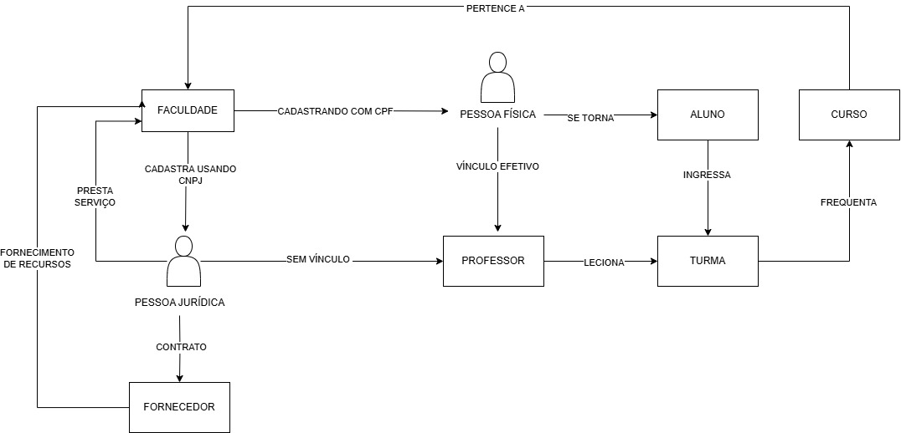
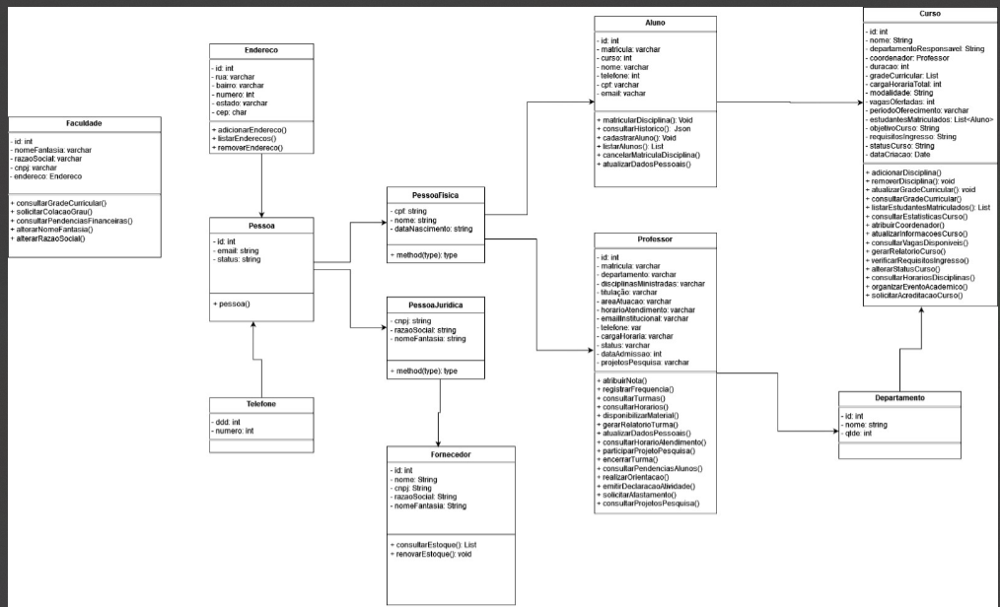
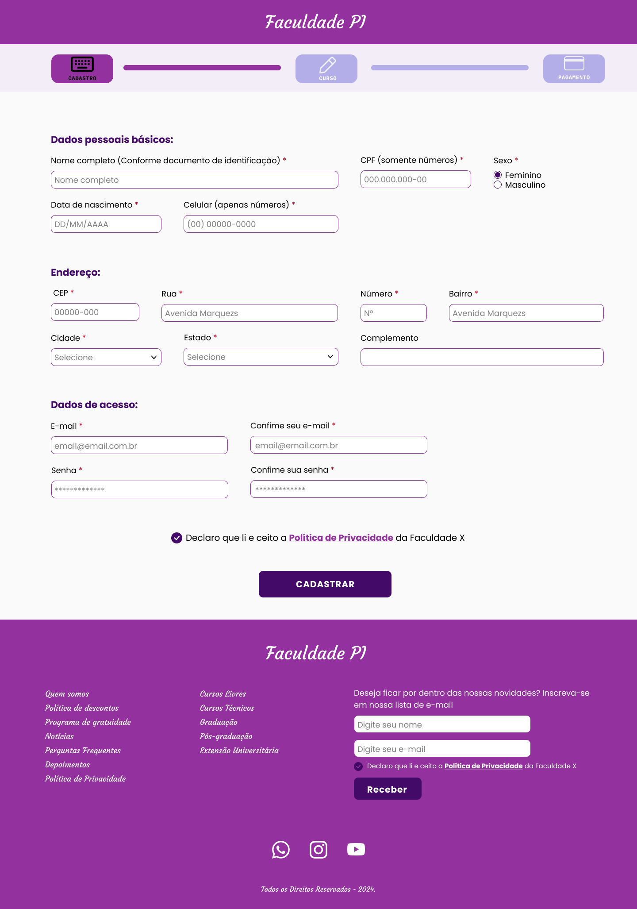
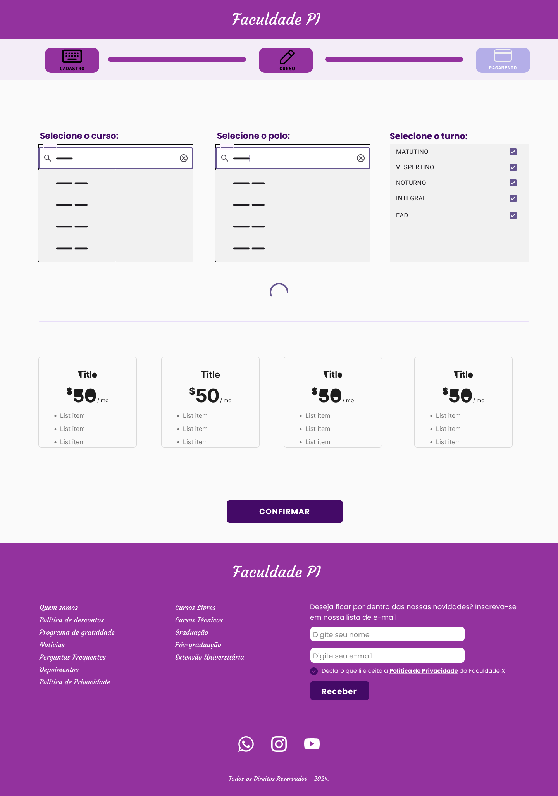
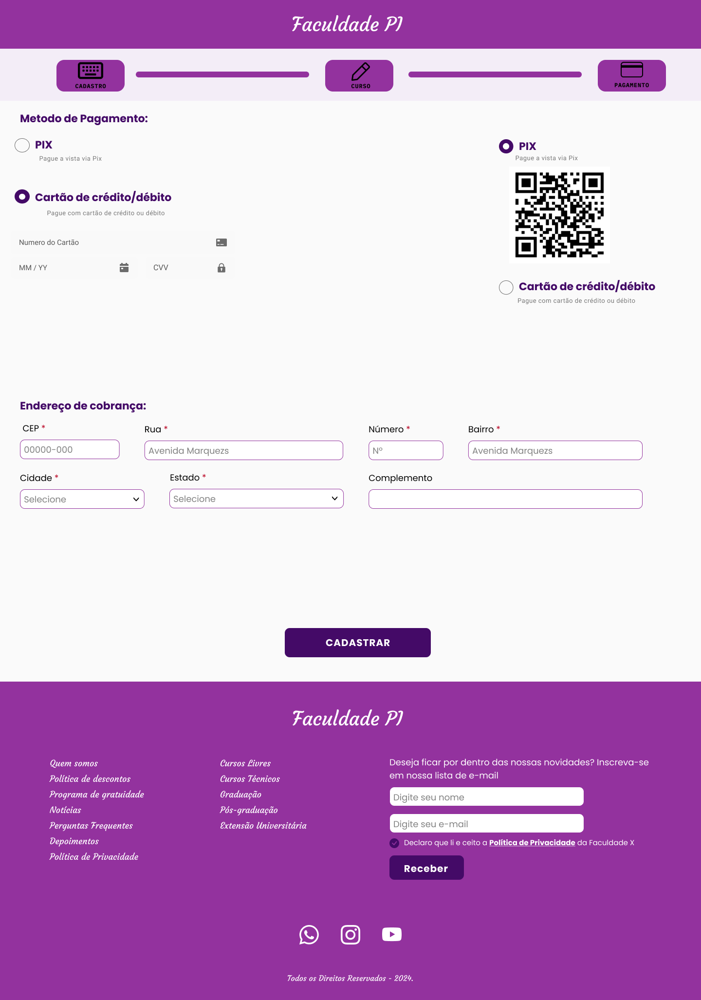
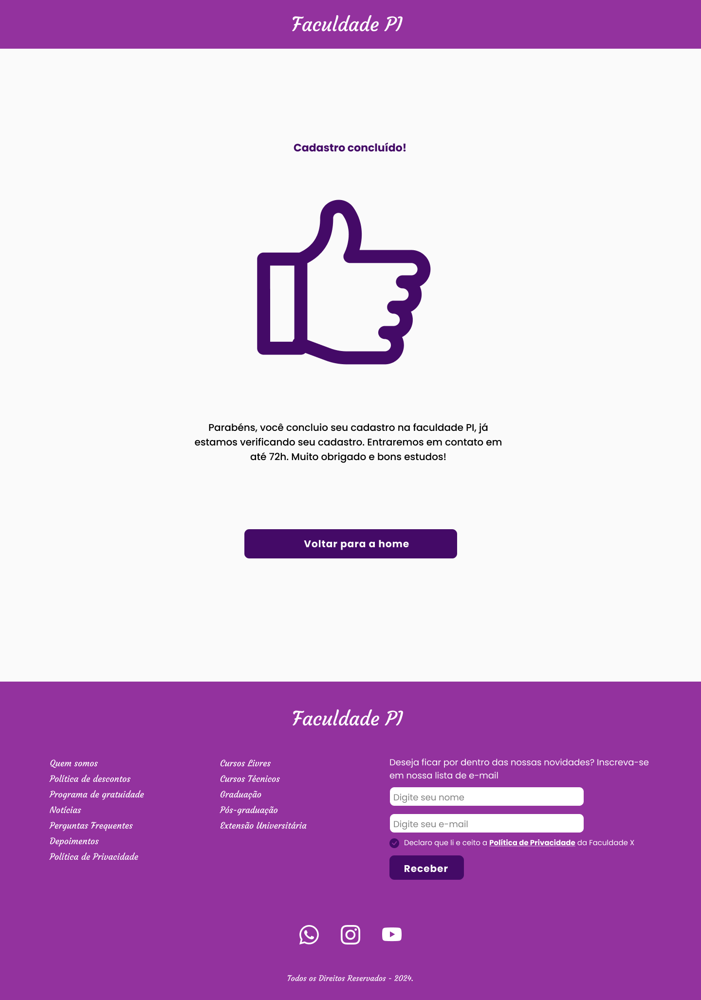

# Segunda entrega do Projeto Integrador - Senac Ead

Os protótipos da interface do sistema são baseados no diagrama de **caso de uso** do **sistema de cadastro de uma faculdade**, que foi desenvolvido na primeira fase do Projeto Integrador. Abaixo apresentamos o diagrama criado:

> ### Diagrama de caso de uso
> 

> **Diagrama de classe**

Para desenvolver o protótipo funcional foi usado a ferramenta de design **[Figma](https://www.figma.com)**.

O nome escolhido para o protótipo foi "**Faculdade PI**" (nome fictício). **[clique aqui para ver o protótipo](https://www.figma.com/design/pkkBQVRADTYcfmO2tnlJQj/Projeto-Integrador-II?node-id=0-1&t=pEZ4a5mmYh5KkvhL-1)**

### Jornadas do protótipo:
- Cadastro de Pessoa Física ​
- Cadastro de Pessoa Jurídica ​
- Cadastro de Professores ​
- Cadastro de Fornecedores ​
- Cadastro de Alunos

Na tela inicial de cadastro tem-se 3 opções disponíveis para o **tipo de entidade**, sendo elas "Aluno", "Professor" e "Fornecedor". Deve-se escolher conforme o papel que vai desempenhar.

> ### Cadastro da entidade "Aluno"
> A **primeira** tela mostra um formulário de cadastro dividido em 3 seções: "Dados pessoais básicos", "Endereço" e "Dados de acesso", que possui campos obrigatórios e opcionais.
> 
> A **segunda** tela oferece uma interface simples e intuitiva para o usuário escolher o curso, polo e horário de preferência. Também apresenta as formas de pagamento e os valores disponíveis para curso, mensalidades, etc. O layout e as funcionalidades facilitam a navegação.
> 
> A **terceira** tela mostra a etapa de pagamento do curso escolhido. Os meios podem ser cartão de crédito ou débito, pix e boleto (adicionar forma boleto).
> 
> A **quarta** tela exibe a confirmação de cadastro e a inscrição em determinado curso
> 

> ### Cadastro da entidade "Professor"
> A **primeira** tela mostra um formulário de cadastro dividido em 4 seções: "Dados pessoais básicos", "Endereço", "Ensino" e "Dados de acesso", que possui campos obrigatórios e opcionais.
> 

> ### Cadastro da entidade "Fornecedor"
> A **primeira** tela mostra um formulário de cadastro dividido em 3 seções: "Dados do fornecedor", "Endereço" e "Dados de acesso", que possui campos obrigatórios e opcionais.
> 

> ### Jornada de pessoa física
> A **primeira** tela mostra um formulário de cadastro dividido em 3 seções: "Dados pessoais básicos", "Endereço" e "Cargo", que possui campos obrigatórios e opcionais, além de possuir a opção de fazer uploads com o curriculum vitae, carteira de trabalho e um "sobre mim".
> 

> ### Jornada de pessoa jurídica
> A **primeira** tela mostra um formulário de cadastro dividido em 2 seções: "Dados da empresa" e "Endereço". Ela possui campos obrigatórios e opcionais, além da opção de fazer upload de um arquivo PDF com informações sobre a empresa.
> 

> ### Conclusão
> Em resumo, para o projeto "Faculdade PI", fizemos um protótipo funcional de um sistema de cadastro acadêmico,com base nos diagramas de caso de uso e de classe que desenvolvemos anteriormente. Utilizamos o Figma para criar as interfaces, que abrangem as jornadas de cadastro de Alunos, Professores, Fornecedores, Pessoas Físicas e Jurídicas.

> Organizamos cada jornada em formulários com campos obrigatórios e opcionais, além de incluir funcionalidades como uploads de documentos e seleção de opções específicas. Para os alunos, elaboramos etapas adicionais, como escolha de curso, polo e horário, pagamento e confirmação. Criamos um protótipo simples e funcional, atendendo às necessidades de diferentes perfis no ambiente acadêmico.
